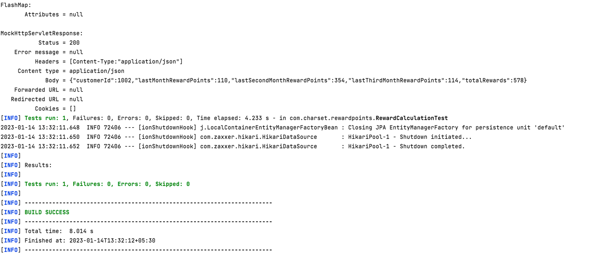
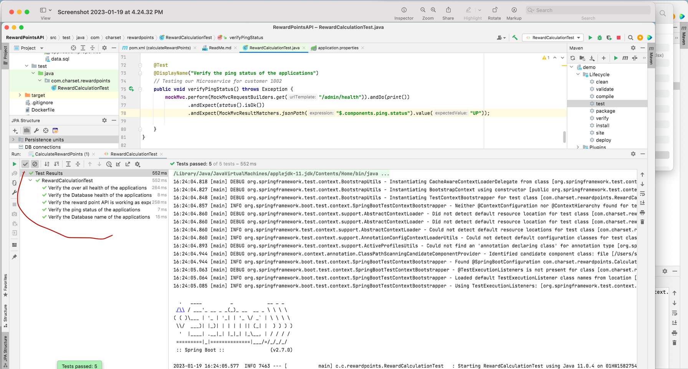

# Custmoer Reward Point

## API specification:

Get Mappping, without Authentication and Authorization

EndPointType : GET
EndPoint URI/ URL : http://localhost:8080/customers/{customerId}/rewards

<h2> DataSet </h2>

**Customer List**
1. *Before Transaction Processed*

|lastMonthRewardPoints | lastSecondMonthRewardPoints | lastThirdMonthRewardPoints | Total Rewards|CustomerId|
| :---                    |         :----:          |  ----:     |        ----:     | ----:   
|0                         | 0                      |  0        |         0  |    1001
|0                         | 0                      |  0        |         0  |    1002
|0                         | 0                      |  0        |         0  |    1003

2. *After Transaction Processed*

|lastMonthRewardPoints | lastSecondMonthRewardPoints | lastThirdMonthRewardPoints | Total Rewards|CustomerId|
| :---                    |         :----:          |  ----:     |        ----:     | ----:  
|270                         | 210                      |  125        |          605 | 1001
|110                         | 354                      |  114        |          578 | 1002
|0                         | 1244                      |  1074       |          2318 |  1003

**Results Images**
**Images of Dataset and Result outcome**

### Implementation Insights:

1. The mock data is loaded during coonstructor based injection
2. It will calculate the rewards of last 3 months 
3. It will also calculate the total reward of a customer
4. The package name is structured as 'com.charset.rewardpoints'
5. H2 In-memory database is used to store data
6. Exception will be thrown if customer doesn't exist

try hitting http://localhost:8080/customers/{customerId}/rewards ,if you are running locally.

If you are running docker container, please change it port to 8080

**Java Runtime Environment : 11**
**Package Manager : Maven version 3.6.3 and above

## How to Run the Code:

1. Load the code to some IDE
2. Refresh Maven dependencies
3. Look for a clean build
4. Run as springboot project
5. Hit the URI mentioned above with GET type

## How to Run Test Cases:

1. Select the RewardCalculationTest.java file
2. Run or debug as Junit
3. Observe the results at IDE

   
   

## How to dockerize:

1. Get to the root of this project
2. Execute following commands -
   a) docker build -t spring-boot-docker:spring-docker .
   b) docker run -p 8080:8080 spring-boot-docker:spring-docker

## Health Check endpoint :

http://localhost:8080/admin/health
1. Implemented Spring boot actuator in the project, this will help to manage and monitor the application by using HTTP endpoints
   mainly in production ready environment
2. All the configuration done in application.properties file
3. Changed the base path to /admin
4. Exposed the health API and all necessary informations(Eexample:Application status, DB status, DB name, Ping status )

    