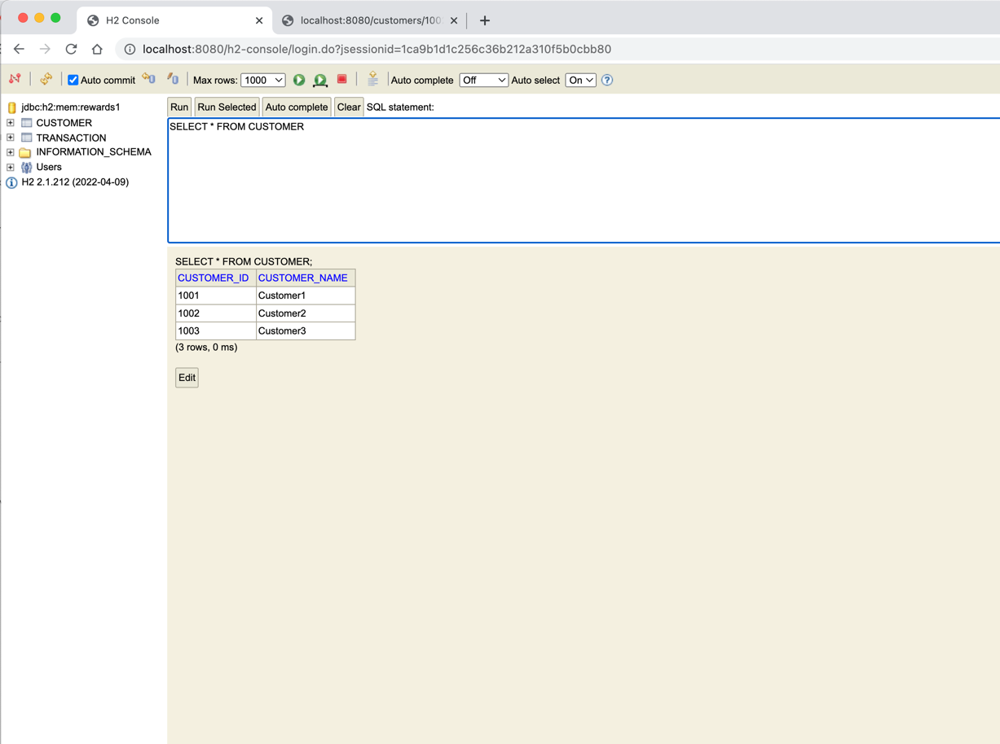

# Getting Started

### Reference Documentation

**Images of Dataset and Result outcome**

**Steps to use this Microservice**
1. Clone the project from Github using 'git clone URL'  
2. Make sure Java and Maven installed in the local system with all path set properly
3. run maven command 'mvn spring-boot:run'
4. Hit the API end point '/customers/<customerId>/rewards'(Ex: http://localhost:8080/customers/1002/rewards)
5. Test the service using the below maven command
   'mvn test'
6. If all test passed then we can conclude the microservice is working as expected
7. The pacjage name is structured as 'com.charset.rewardpoints'
8. H2 In-memory database is used to store data
9. Exception will be thrown if customer doesn't exist
10. Refer the doc attached below to calculate the reward points 
    'Document'
11. The service is dockerized, The Dockerfile is created and kept in the main project folder
12. please perform the below commands: 
     docker build -t spring-boot-docker:spring-docker .
     docker run -p 8080:8080 spring-boot-docker:spring-docker 
13. The flag -p creates a firewall rule which maps the previously exposed container port :8080 to the :8080 port on local machine
14. Hit the API end point '/customers/<customerId>/rewards'(Ex: http://localhost:8080/customers/1002/rewards)
15. Test the service using the below maven command
    'mvn test'
    
    